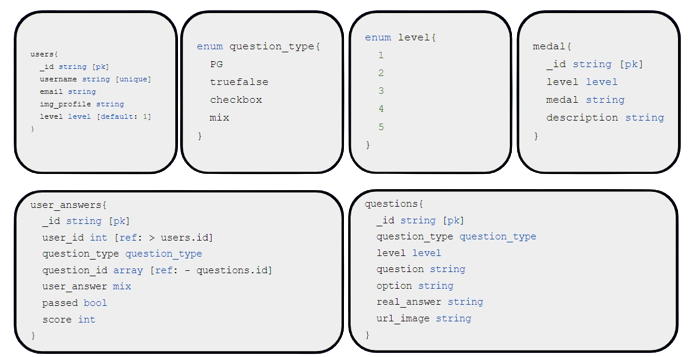
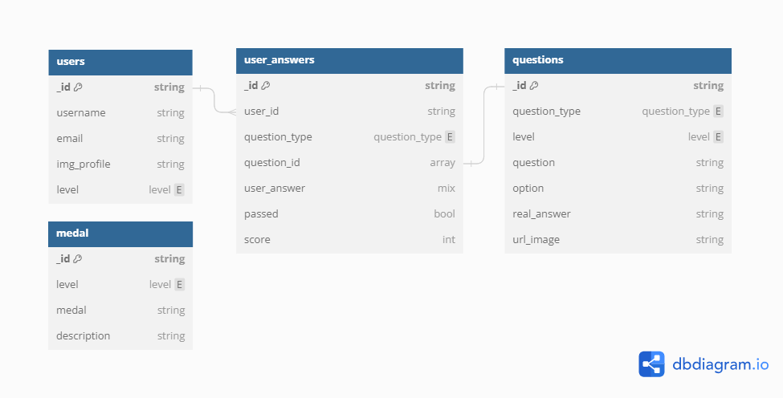

# Digiwise Backend

Final capstone project of Generasi Gigih 3.0 Fullstack Track

Link to the website : [Digiwise](https://digiwise.vercel.app/)

## **Tech Stack**

<div align="left">

  
 
</div>

## Table of Content

1. [Database structure](#database-structure)
2. [Endpoint](#endpoint)
3.
4. [How to Run in Local](#how-to-run-in-local)

https://drive.google.com/file/d/14H7tm-U2wV0Bjg-l5ZrelLD7cr82eqCO/view?usp=drive_link

## Database Structure




## Endpoint

### Question

1. Method POST `http://localhost:5000/questions`
2. Method GET `http://localhost:5000/questions/:id`
3. Method GET `http://localhost:5000/questions`

### User

#### Question

1. Method GET `http://localhost:5000/users/questions?level=2` to get question by level

#### Login Register

1. Method POST `http://localhost:5000/users/register` to register user
2. Method POST `http://localhost:5000/users/login` to login user

#### Answer User

1. Method POST `http://localhost:5000/users/answers` to send user answer

#### Data User

1. Method GET `http://localhost:5000/users` to get all user
1. Method GET `http://localhost:5000/users/:id` to get user by id

## How to Run in Local

1. Clone the repository to your local machine.
   ```bash
   git clone https://github.com/Digiwise-APP/backend-digiwise.git
   ```
2. Open a new terminal window and navigate to the backend directory
   ```bash
   cd backend-digiwise
   ```
3. Install the dependencies for the backend
   ```bash
   npm i
   ```
4. Start the backend server on port 5000
   ```bash
   nodemon index.js
   ```
